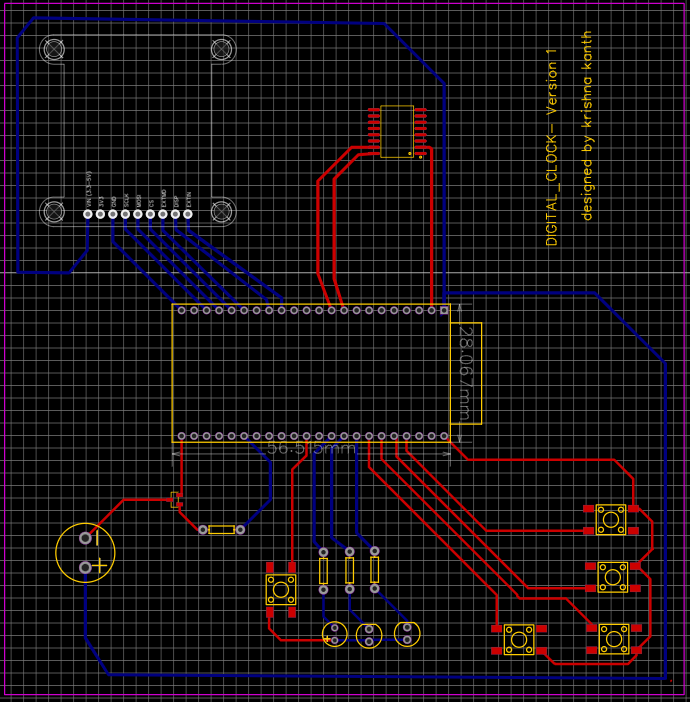
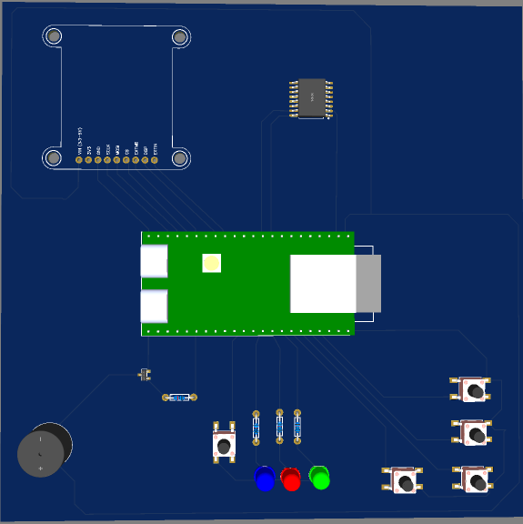

# ⏰ Smart Digital Clock — Version 1
**Designed & Built from Fundamentals by Krishna Kanth**

[](https://www.espressif.com/)
[](https://www.analog.com/)
[](#pcb-design--layout)
[](#the-journey)

---

## 📖 Table of Contents
- [The Journey](#-the-journey)
- [Project Overview](#-project-overview)
- [Key Features](#-key-features)
- [System Architecture & Block Diagram](#-system-architecture--block-diagram)
- [Hardware Design & Components](#-hardware-design--components)
- [PCB Design & Layout Iterations](#-pcb-design--layout-iterations)
- [Pinout & GPIO Mapping](#-pinout--gpio-mapping)
- [Firmware Architecture](#-firmware-architecture)
- [Getting Started & Installation](#-getting-started--installation)
- [Future Roadmap](#-future-roadmap)

---

## 🚀 The Journey

> *"How is a digital clock actually built?"*

This project originated with a simple question and a desire to build a timing instrument from the physical principles up.

```
                      THE EVOLUTION OF THE DESIGN
  ┌─────────────────────────────────────────────────────────────────┐
  │ 1. Fundamentals First: Discrete Digital Logic                   │
  │    Quartz Oscillator (32.768 kHz) ──► Frequency Divider         │
  │    ──► BCD Decade Counters ──► 7-Segment Decoders ──► Display    │
  └───────────────────────────────┬─────────────────────────────────┘
                                  │ Realized: PCB complexity, component
                                  │ density & lab equipment constraints
                                  ▼
  ┌─────────────────────────────────────────────────────────────────┐
  │ 2. The Architectural Pivot: ESP32-S3 Embedded System            │
  │    Retain hardware-first focus while enabling extensible logic, │
  │    clean UI, and rich peripheral integration.                   │
  └───────────────────────────────┬─────────────────────────────────┘
                                  │ Problem: Losing time on power loss
                                  ▼
  ┌─────────────────────────────────────────────────────────────────┐
  │ 3. Robust Timekeeping: DS3231M Temperature-Compensated RTC      │
  │    Independent coin-cell backup power + I²C bus synchronization │
  │    ensures zero time loss during power cycles or restarts.      │
  └───────────────────────────────┬─────────────────────────────────┘
                                  │ Challenge: First PCB layout congested
                                  ▼
  ┌─────────────────────────────────────────────────────────────────┐
  │ 4. Engineering Iteration: GPIO Re-planning & Clean PCB Routing  │
  │    Reallocated MCU pinouts to eliminate criss-crossing tracks,   │
  │    optimized thermal/ground return, and shaped a custom board.  │
  └─────────────────────────────────────────────────────────────────┘
```

### The Initial Concept
The original roadmap avoided microcontrollers entirely. The plan was to synthesize digital logic directly using:
- A $32.768\text{ kHz}$ quartz crystal oscillator.
- Binary ripple counters / frequency dividers (e.g., 4060 / 74HC393) to achieve a precise $1\text{ Hz}$ tick.
- BCD decade counters (e.g., 74HC90 / 74HC390) cascading seconds, minutes, and hours.
- BCD-to-7-segment decoders (e.g., 74HC47 / 4511) driving numerical displays.

### The Real-World Engineering Pivot
Designing the full clock strictly out of discrete digital logic required significant board area, dozens of IC packages, and extensive lab test bench hardware. Rather than compromising on completing a robust device, the architecture was pivoted toward a modern embedded system driven by the **ESP32-S3**.

### Solving the Power & Volatility Challenge
A common pitfall in basic microcontroller clocks is relying on `millis()` or software timers: whenever the device is unplugged or rebooted, the time resets to zero. To make this an authentic consumer-grade clock, a dedicated **DS3231M Real-Time Clock (RTC)** was integrated. Equipped with a backup power cell and an internal temperature-compensated resonator, the DS3231M keeps running continuously. On boot, the ESP32-S3 queries the DS3231M over **I²C** (`SDA` & `SCL`) and updates the display immediately without requiring user re-configuration.

---

## 💡 Project Overview

The **Smart Digital Clock (Version 1)** is a standalone embedded product engineered from schematic capture to custom PCB layout and firmware programming.

```
       ┌─────────────────────────────────────────────────────┐
       │                  TFT Color Display                  │
       │                   (SPI Interface)                   │
       └──────────────────────────▲──────────────────────────┘
                                  │ SPI (SCLK, MOSI, CS, DISP...)
┌────────────────────┐   ┌────────┴────────┐   ┌─────────────────────┐
│  DS3231M MEMS RTC  │◄──┤    ESP32-S3     ├──►│   3x Status LEDs    │
│ (I2C: SDA / SCL)   │   │  Core Controller│   │ (Blue, Red, Green)  │
└────────────────────┘   └──┬────────────┬─┘   └─────────────────────┘
                            │            │
       ┌────────────────────┴───┐    ┌───┴───────────────────┐
       │ 5x Tactile Pushbuttons │    │ Piezo Buzzer & Driver │
       │ (Nav, Set, Mode, Alarm)│    │ (NPN Transistor Stage)│
       └────────────────────────┘    └───────────────────────┘
```

### Key Highlights
- **ESP32-S3 Dual-Core Brain**: High-performance 240 MHz MCU with native USB-C interface and rich GPIO matrix.
- **Ultra-Reliable Timekeeping**: DS3231M RTC IC communicating over I²C with backup battery power.
- **Vibrant Display Subsystem**: Dedicated multi-pin header with SPI lines (`SCLK`, `MOSI`, `CS`, `DISP`, `EXTMD`, `EXTIN`).
- **Ergonomic Tactile Keypad**: 5 pushbuttons arranged for one-handed navigation, menu cycling, alarm toggling, and time adjustment.
- **Audio Feedback**: Active/Passive Piezo buzzer driven through an NPN transistor switching circuit with flyback/pull-down safety.
- **Visual State Indicators**: Blue, Red, and Green 5mm through-hole LEDs with dedicated current-limiting resistors.

---

## 📐 PCB Design & Layout

| 2D CAD Routing (Top: Red / Bottom: Blue) | 3D Assembled Board Visualization |
| :---: | :---: |
|  |  |
| *Top Layer (Red) & Bottom Layer (Blue) Traces* | *Populated Board with ESP32-S3, RTC, LEDs & Buzzer* |

*(Images saved in the repository `assets/` directory)*

### The Routing Journey: From Congestion to Clean Geometry
1. **Iteration 1 (Congested)**:
   - Components were initially placed based purely on aesthetic spacing.
   - Long traces criss-crossed between the microcontroller and peripherals, requiring excessive vias and causing potential noise coupling between high-speed display lines and low-frequency signals.
2. **Iteration 2 (Optimized & Clean)**:
   - Re-evaluated the ESP32-S3 pin matrix and systematically assigned adjacent GPIOs to their corresponding functional clusters.
   - Grouped the **TFT Display** lines directly on the top-left quadrant for short, parallel SPI traces.
   - Positioned the **DS3231M RTC** on the upper-right quadrant with direct, uninterrupted I²C differential routing.
   - Clustered the **tactile pushbuttons** and **indicator LEDs** along the bottom right and bottom center, minimizing track lengths.
   - Routed the **buzzer drive stage** on the bottom-left with a dedicated transistor switch to isolate acoustic switching noise.
   - Added chamfered 45° corner cutouts on the PCB boundary for an ergonomic, modern profile.

---

## 🔌 Hardware Specifications & Bill of Materials (BOM)

| Subsystem | Component / Part | Package / Footprint | Description / Role |
| :--- | :--- | :--- | :--- |
| **Main MCU** | ESP32-S3 DevBoard | 56.5 x 28.1 mm Dual-in-line | Dual-core 32-bit Xtensa LX7, 240MHz, USB-C |
| **RTC** | DS3231M | SOIC-8 / SOIC-16 | ±5ppm MEMS-based Real-Time Clock (I²C) |
| **Display Header** | 8-Pin 2.54mm Header | Through-hole | SPI Display interface (`VIN`, `3V3`, `GND`, `SCLK`, `MOSI`, `CS`, etc.) |
| **User Input** | 5x Tactile Switches | 6x6 mm Tactile Button | Menu, Up, Down, Select, Alarm Ack |
| **Visual Indicators**| 3x 5mm LEDs | Through-hole (Blue, Red, Green) | Status: Blue (Running), Red (Alarm/Warn), Green (Sync/OK) |
| **Resistors** | 3x 220Ω / 330Ω | Axial Through-Hole | Current limiting for status LEDs |
| **Buzzer Driver** | SOT-23 NPN / BJT | SOT-23 / TO-92 | Transistor driver for Piezo buzzer |
| **Audio Indicator** | 12mm Piezo Buzzer | 7.6mm pitch Through-hole | Acoustic alert, hourly chime & button beeps |
| **Passive Network** | Resistors (1kΩ, 10kΩ) | Axial / 0805 | Base drive & pull-up/pull-down stabilization |

---

## 📌 Pinout & Hardware Interfacing

```
                              ESP32-S3 CONTROLLER
                      ┌────────────────────────────────┐
        [SPI SCLK] ───┤ GPIO xx                GPIO yy ├─── [I2C SCL] (DS3231M)
        [SPI MOSI] ───┤ GPIO xx                GPIO yy ├─── [I2C SDA] (DS3231M)
          [SPI CS] ───┤ GPIO xx                GPIO zz ├─── [LED 1 - Blue]
     [DISP_ENABLE] ───┤ GPIO xx                GPIO zz ├─── [LED 2 - Red]
          [KEY_UP] ───┤ GPIO xx                GPIO zz ├─── [LED 3 - Green]
        [KEY_DOWN] ───┤ GPIO xx                GPIO ww ├─── [Buzzer PWM / Tr.]
       [KEY_ENTER] ───┤ GPIO xx                        │
        [KEY_MODE] ───┤ GPIO xx                        │
                      └────────────────────────────────┘
```

### 1. DS3231M Real-Time Clock (I²C Bus)
- **SDA** ──► ESP32-S3 I²C Data Pin (with 4.7kΩ pull-up)
- **SCL** ──► ESP32-S3 I²C Clock Pin (with 4.7kΩ pull-up)
- **VCC / GND** ──► 3.3V Power Rail & Common Ground

### 2. Display Interface Header
- `VIN / 3V3` ──► System Power Rails
- `GND` ──► System Ground Plane
- `SCLK` ──► SPI Hardware Clock
- `MOSI` ──► SPI Master-Out-Slave-In Data Line
- `CS` ──► Chip Select (Active Low)
- `EXTMD / DISP / EXTIN` ──► Display Enable & Mode Selection

### 3. Tactile Button Cluster
- Configured using internal pull-up resistors (`INPUT_PULLUP`).
- Pressed state reads logic `LOW`.
- Debounced in software using non-blocking timing windows ($30\text{–}50\text{ ms}$).

### 4. Buzzer Stage
- Driven via NPN transistor base to isolate high switching currents from the ESP32-S3 GPIO.
- Controlled using ESP32 `ledc` PWM for frequency-configurable melodic tones and alarms.

---

## 💻 Firmware Architecture (`digital_clock_version1.ino`)

The firmware is designed with a non-blocking finite state machine (FSM) architecture:

```
                      ┌────────────────────────┐
                      │      System Boot       │
                      │  Init I/O, RTC & Disp  │
                      └───────────┬────────────┘
                                  │
                                  ▼
                      ┌────────────────────────┐
                 ┌───►│    STATE: NORMAL_TIME  │◄───┐
                 │    │ Displays HH:MM:SS, Date│    │
                 │    └───────────┬────────────┘    │
        Timeout/ │                │ Mode Press      │ Back / Done
        Save     │                ▼                 │
                 │    ┌────────────────────────┐    │
                 ├────┤   STATE: SET_TIME_DATE │────┤
                 │    │ Edit Hour/Min/Day/Mon  │    │
                 │    └───────────┬────────────┘    │
                 │                │ Mode Press      │
                 │                ▼                 │
                 │    ┌────────────────────────┐    │
                 └────┤   STATE: ALARM_CONFIG  │────┘
                      │ Set Alarm Time & Enable│
                      └────────────────────────┘
```

### Firmware Functional Flow:
1. **Boot Initialization**:
   - Initializes Serial debug port ($115200\text{ baud}$).
   - Initializes I²C bus and detects the **DS3231M**.
   - If RTC has lost power, fallback time is configured or retrieved.
   - Initializes TFT display and draws the static clock UI layout.
   - Configures LED pins as `OUTPUT` and Pushbuttons as `INPUT_PULLUP`.
2. **Main Superloop (`loop`)**:
   - **Time Acquisition**: Reads current timestamp (`DateTime now = rtc.now()`) once per second or via $1\text{ Hz}$ interrupt.
   - **Display Refresh**: Updates only modified digits/elements to avoid display flicker.
   - **Keypad Scanning**: Scans pushbuttons with non-blocking software debouncing.
   - **Alarm Engine**: Compares current time against active alarm registers; fires buzzer PWM melody and flashes Red LED when matched.
   - **Status Lighting**:
     - 🔵 **Blue LED**: System heartbeat / clock operational.
     - 🟢 **Green LED**: Time valid & RTC synchronized.
     - 🔴 **Red LED**: Alarm triggering or setup mode active.

---

## 🛠️ Getting Started & Installation

### Requirements
1. **Arduino IDE 2.x** or **VS Code with PlatformIO**.
2. **ESP32 Board Support Package**: Install `esp32 by Espressif Systems` via Boards Manager.
3. **Required Libraries**:
   - `RTClib` (by Adafruit) — for DS3231M communication.
   - `Wire` — for I²C protocol handling.
   - `SPI` & Display Driver (e.g., `TFT_eSPI` or `Adafruit_GFX`).

### Flashing the Firmware
1. Connect the ESP32-S3 board to your PC via its USB-C port.
2. Open `smart_digital_clock/digital_clock_version1.ino` in Arduino IDE.
3. Select board: **ESP32S3 Dev Module**.
4. Configure upload settings:
   - **USB CDC On Boot**: Enabled
   - **Flash Size**: 4MB or 8MB (depending on your module)
   - **Upload Speed**: 921600
5. Click **Upload**.
6. Open the Serial Monitor at **115200 baud** to view real-time diagnostics.

---

## 🔮 Future Roadmap (Version 2 & Beyond)

- [ ] **NTP Internet Time Sync**: Leverage the ESP32-S3's Wi-Fi capability to periodically synchronize the DS3231M against atomic time servers.
- [ ] **BLE Companion App**: Configure alarms, color themes, and time zones wirelessly via smartphone.
- [ ] **Ambient Light Dimming**: Integrate an LDR (Light Dependent Resistor) to auto-adjust display brightness for night-time use.
- [ ] **Enclosure Design**: Design a 3D-printed snap-fit desktop chassis complimenting the PCB's chamfered corners.

---

## 👨‍💻 Author & Acknowledgments

- **Designer & Developer**: [Krishna Kanth](https://github.com/krishna-kidfullstacker)
- **Project**: Hardware Projects / Smart Digital Clock Version 1
- **Focus**: Embedded systems hardware design, PCB routing, sensor interfacing, and microcontroller firmware.

---
*“Understanding how the electronics behind an embedded product come together — from discrete logic principles to physical copper traces.”*
